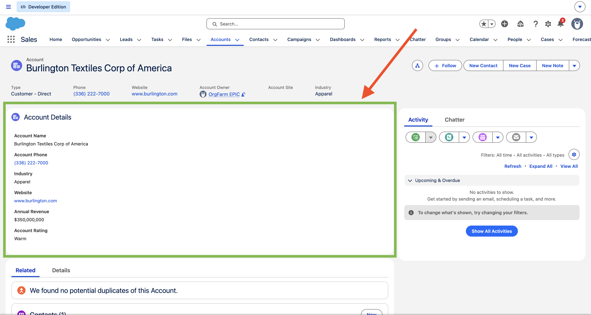

# Project 1 — Account Viewer Card

A Lightning Web Component that displays key Account fields on a Salesforce record page using Lightning Data Service (LDS).

## Screenshot

## What I Learned
- LWC file structure (HTML, JS, XML)
- Lightning Data Service (LDS) — fetching record data without Apex
- `lightning-record-view-form` and `lightning-output-field`
- `@api recordId` — getting the current record ID from the page
- Deploying a component using Salesforce CLI
- Adding a component to a Lightning App Builder page

## Tech Stack
- Lightning Web Components (LWC)
- Lightning Data Service (LDS)
- SLDS (Salesforce Lightning Design System)

## Component
`accountViewerCard` — placed on Account record pages

## How to Deploy
1. Authorise your Salesforce org
2. Deploy the component
3. Add to an Account record page via Lightning App Builder