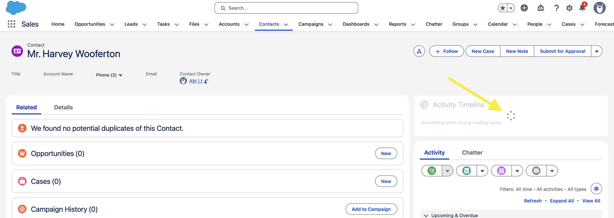
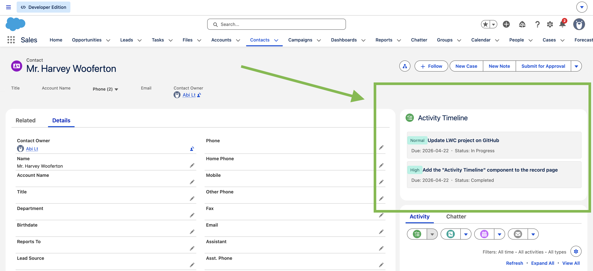
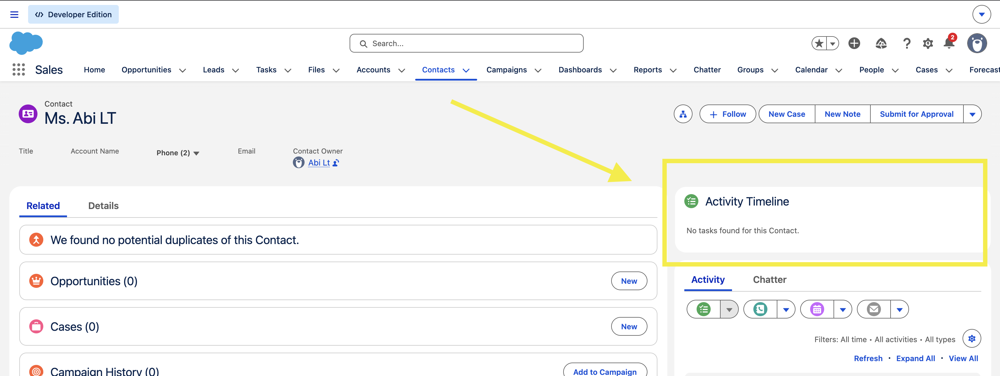
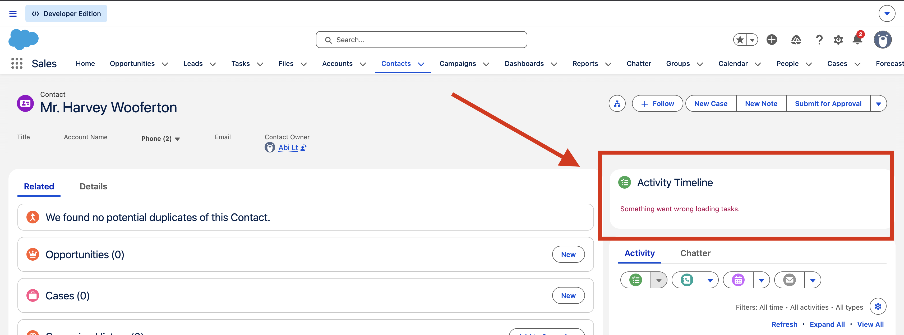

# Project 2 — To-Do Task Manager

A Lightning Web Component that displays all Tasks on a Salesforce Contact record page using Apex, SOQL, LWC, LDS, SLDS.

## Screenshot
Loading State

Task List

Empty State

Error State

## What I Learned
- LWC file structure (HTML, JS, XML)
- Lightning Data Service (LDS) — fetching record data without Apex
- `lightning-record-view-form` and `lightning-output-field`
- `@api recordId` — getting the current record ID from the page
- Deploying a component using Salesforce CLI
- Adding a component to a Lightning App Builder page

## Tech Stack
- Apex Controller
- SOQL to fetch Tasks of a specific Contact
- Lightning Web Components (LWC)
- Lightning Data Service (LDS)
- SLDS (Salesforce Lightning Design System)

## Component
`contactActivityTimeline` — placed on Contact record pages

## How to Deploy
1. Authorise your Salesforce orgcd
2. Deploy the component
3. Add to a Contact record page via Lightning App Builder