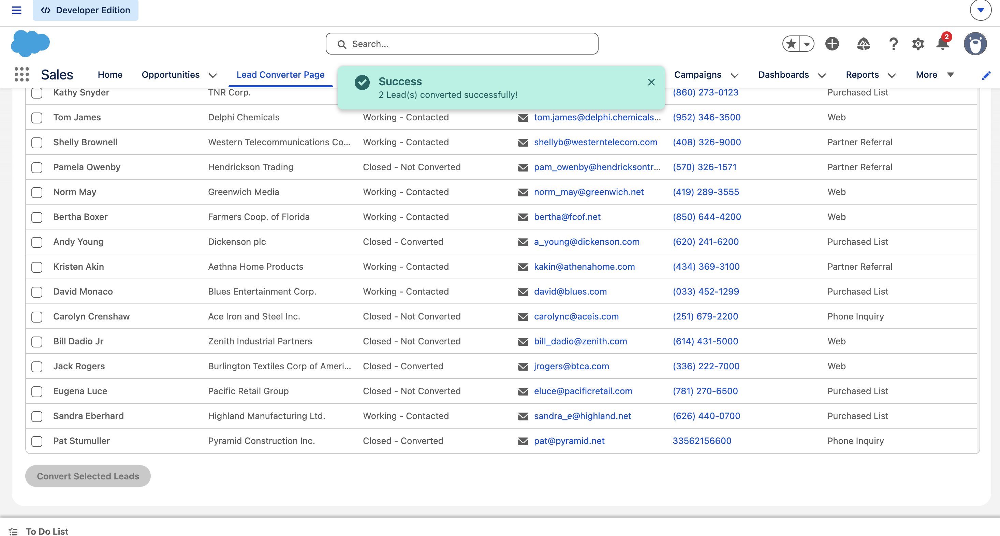
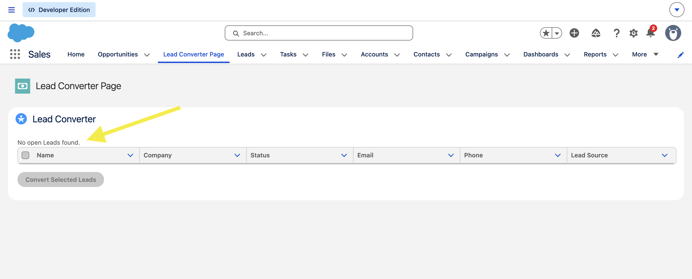
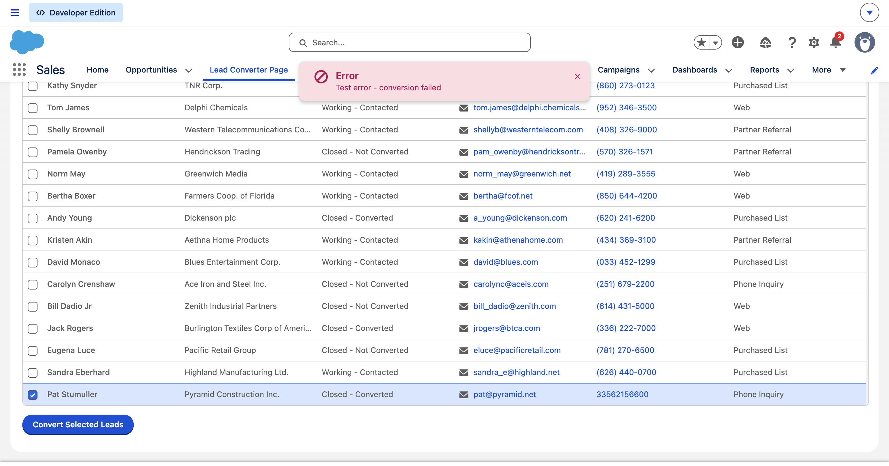

# Project 3 — Lead Converter

A Lightning Web Component that allows sales reps to view all open Leads and convert them to Contact, Account and Opportunity with a single click, directly from a Salesforce App Page.

## Screenshot

When there are no open Leads:

When there is an error during conversion:

## What I Learned
- Writing an Apex controller with multiple methods
- `Database.LeadConvert` — Salesforce built-in Lead conversion
- `Database.convertLead()` with `allOrNone = false` for partial success
- Calling Apex imperatively (on button click) vs `@wire` (on load)
- `lightning-datatable` with row selection
- `refreshApex` to refresh wire data after a DML operation
- `ShowToastEvent` for success and error notifications
- `async/await` for handling asynchronous Apex calls
- Querying `LeadStatus` setup object dynamically

## Tech Stack
- Lightning Web Components (LWC)
- Apex
- SOQL
- Lightning Data Service
- SLDS (Salesforce Lightning Design System)

## Objects Used
- `Lead` — fetched and converted
- `LeadStatus` — queried to get conversion status dynamically
- `Contact`, `Account`, `Opportunity` — created during conversion

## Component
`leadConverter` — placed on a custom App Page accessible from the Sales app navigation

## How to Deploy
1. Authorise your Salesforce org
2. Deploy the Apex class
3. Deploy the component
4. Add to a Lightning App Page via Lightning App Builder